# Display Media Titles for FYT 7862/8581

Android app for FYT displaying media titles on status bar. It displays also artist name if it's present in the metadata. Should work on Android 8 and above. Tested on Android 10 on FYT UIS7862 and on Android 14 on phone.

App works with the players that use MediaController which means that it should get along with most of the available music apps. 

It also supports original FYT player but this requires a simple [launcher modification](./launcher_cooker/README_LAUNCHER.md). You can also use modified [launchers](#modified-launchers-allowing-to-display-stock-player-media-data).

## Installation

App requires five permissions:
* Notification access to be able to read media metadata.
* Display over other apps to properly display titles.
* Battery optimization to keep service alive.
* Phone state to properly remove view on phone calls.
* Call logs to open app with dialer's "secret code".
* Storage to use file picker and .ttf fonts.

Check this [tutorial](https://www.youtube.com/watch?v=H3tnNVyCJfk) in case you have a problem with Restricted Setting pop-up (for non-system apps).

* Non-system app (works on phones, tablets and FYT):

	Download and install `display_media_titles_phone.apk` file. This version due to android restrictions will display titles only if the launcher has a fully transparent status bar, on FYT it might look like there's a shadow on it (it's probably hardcoded, the shadow persists regardless the launcher type/mod).
	User will be prompted to grant permissions mentioned before on the first start. 
	
* System app (only for devices using standard Google keystore i.e. FYT):
	
	- FYT 7862/8581:

		Download `installer.zip`, unpack it in a FAT32 formatted USB pendrive, then connect pendrive to your unit's USB port and wait, installation should start after few seconds.
		Works with every launcher and displays media data on top of everything (no shadow issue).
		Permissions for system apps should be granted automatically.
		
		Use `uninstaller.zip` to remove the app.

	- Other devices using standard Google keystore:

		Install `vasyl.titles.apk` from `installer\_displaymediatitles\vasyl.titles` and [convert it to system app](https://www.google.com/search?client=firefox-b-d&q=how+to+convert+app+to+stsyem).

* Opening app interface:

	This app aims to work in the background therefore it minimizes after having all permissions granted and unchecked "Display UI" CheckBox. I made this function in case it's necessary to mark the app in the FYT system settings as the one that's meant to run at the device boot/wake from sleep. Might be also useful while using in-app autostart option. 
	
	To get the application's view after unchecking "Display UI" CheckBox, please open the dialer and type `*#*#3368#*#*` (if it doesn't work with your stock dialer then install [Phone by Google](https://play.google.com/store/apps/details?id=com.google.android.dialer&hl=en_US)), the app should open it's MainActivity. It is also possible to have the same effect by revoking one of the permissions or in case of non-system app, not to grant it on the first start  (i.e. display over other apps - remember to grant it back to see the result). Revoking notification access might result in the app's crash. User will be able to grant previously revoked permission by pressing according button which glares red if permission is denied.

* Setting view parameters:

	Very simple but intuitive layout allows to set left margin and width of the view depending on the device display width. It also provides following features: caption height, font size, color and typeface. App also supports .ttf fonts (since 1.0.7). Try it with long titles for proper setting.

* Displaying FYT player media titles:

	FYT manufacturers have designed connection between the stock music app and the launcher which depends on intents adressed for specific package. That means that there is no way to intercept the existing message. Fortunately I found a workaround by adding a broadcast to the launcher which receives and forwards that message to any app that has registered a specific receiver. And you can find such receiver in my app.

	Why not to implement such broadcast directly in the music player instead of modifying the launcher? Well, I'm not an expert in modifying smali files, there is also plenty of versions of this music app, moreover stock player stopped working everytime I had tampered with it, not to mention that every test required a trip to garage. If you figure it out, please let me know!

	

	

## Generating app in Android Studio

Clone repository and use `keystore.jks` located in `DisplayMediaTitles\app`. Choose exisiting android key alias with password `android`. 
For non-system app remove `android:sharedUserId="android.uid.system"` from `AndroidManifest.xml`.

FYT uses standard Google keystore, if you want to generate app that will work as a system app on OS that has been signed with different keystore then make sure to use that keystore.

## Gallery

[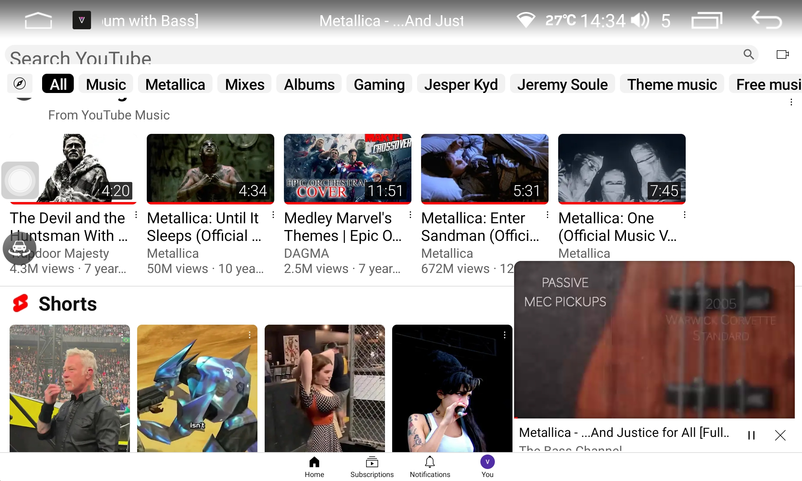](./images/5.png)
[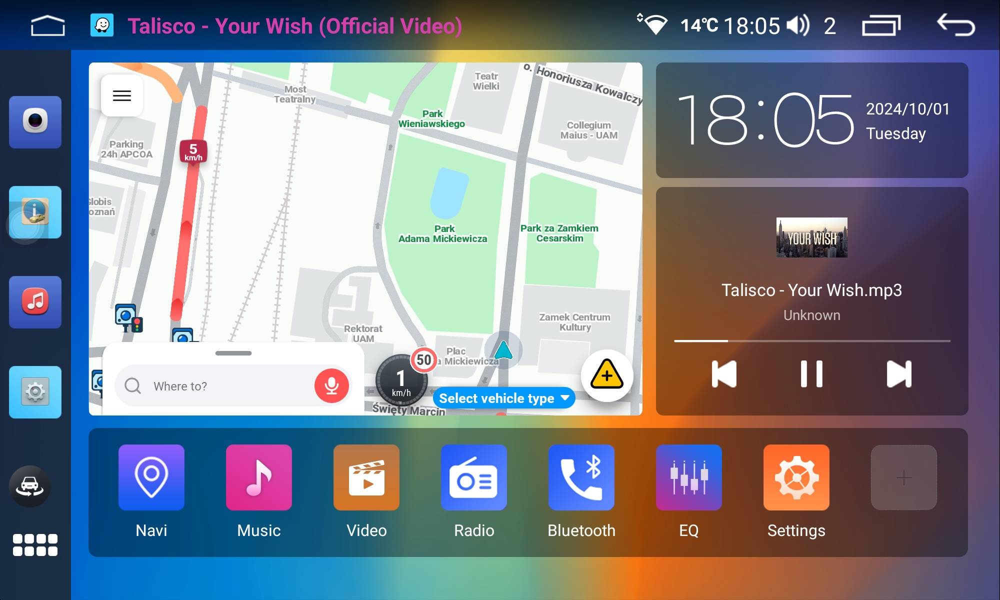](./images/6.png)[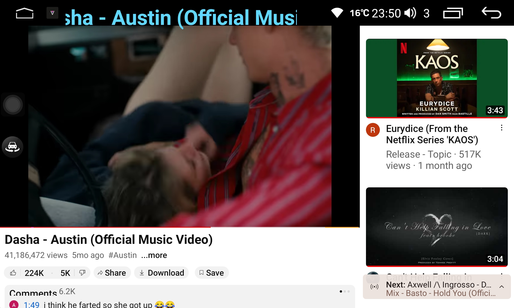](./images/7.png)
[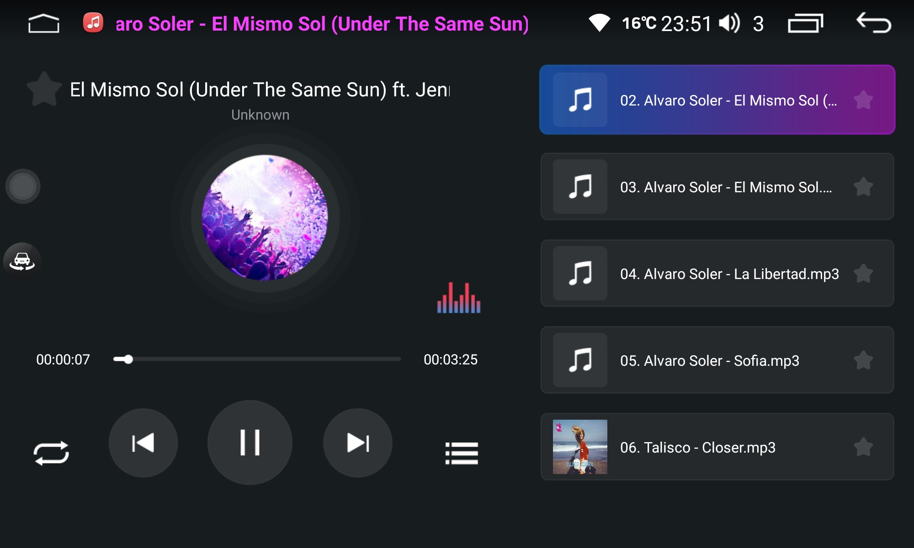](./images/8.png)[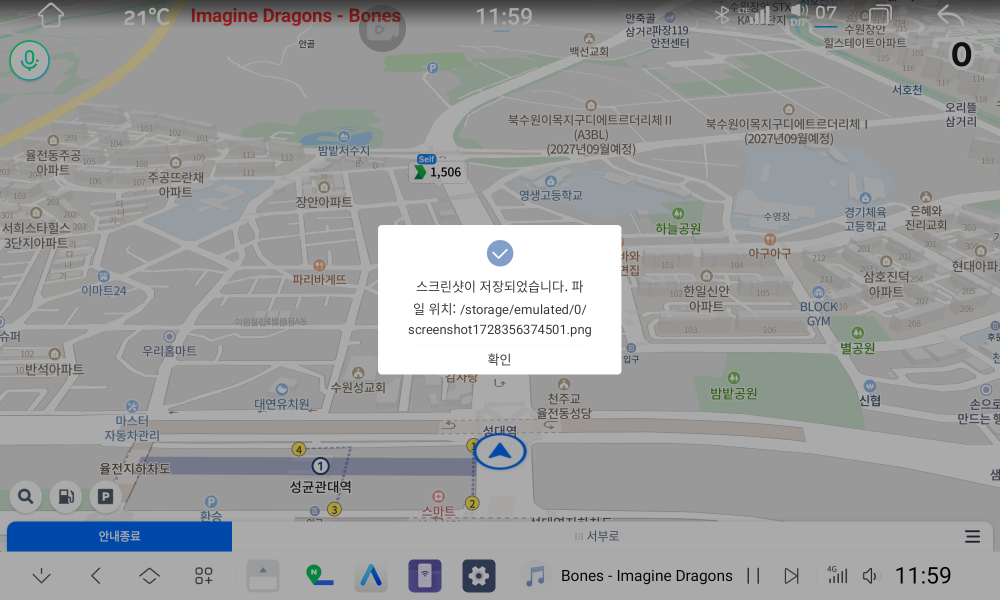](./images/9.png)

## Modified Launchers allowing to display stock player media data

**[HERE](./launcher_cooker/README_LAUNCHER.md) is a full guide how to easily modify most of the existing launchers.**

### 2000x1200

* [launcher29](https://github.com/vasyl91/DisplayMediaTitles/releases/download/launchers/2000x1200_launcher29_installer.rar)

	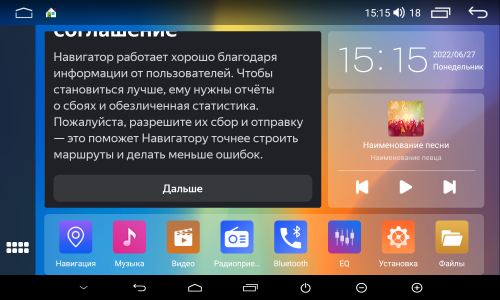

* [launcher34](https://github.com/vasyl91/DisplayMediaTitles/releases/download/launchers/2000x1200_launcher34_installer.rar)

	

* [launcher34_front_app_mod](https://github.com/vasyl91/DisplayMediaTitles/releases/download/launchers/2000x1200_launcher34__front_app_mod_installer.rar)

	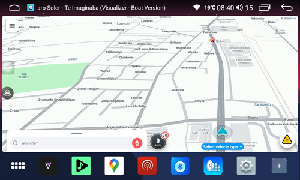

### 1920x720

* [launcher6](https://github.com/vasyl91/DisplayMediaTitles/releases/download/launchers/1920x720_launcher6_installer.rar)

	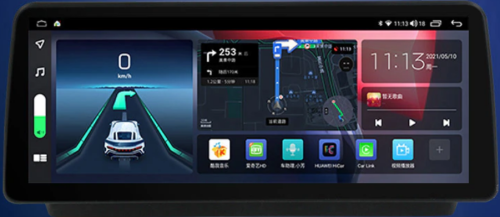

* [launcher13](https://github.com/vasyl91/DisplayMediaTitles/releases/download/launchers/1920x720_launcher13_installer.rar)

	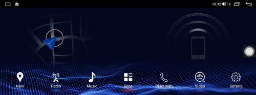

### 1280x720, 1024x600 

* [launcher17](https://github.com/vasyl91/DisplayMediaTitles/releases/download/launchers/1280x720_1024x600_launcher17_installer.rar)

	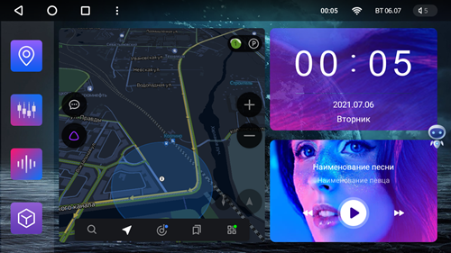

* [launcher29](https://github.com/vasyl91/DisplayMediaTitles/releases/download/launchers/1280x720_1024x600_launcher29_installer.rar)

	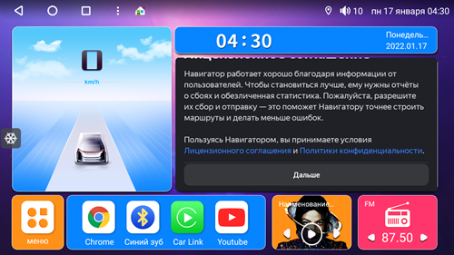

### XDA lauchers from this [thread](https://xdaforums.com/t/modded-fyt-launcher-34-for-uis7862-s-and-uis8581a-and-probably-uis8514a.4618337/)

* [190001034_com.android.launcherBottomMap](https://github.com/vasyl91/DisplayMediaTitles/releases/download/launchers/190001034_com.android.launcherBottomMap_installer.rar)

* [BottomBar2Left-190001034_com.android.launcher34](https://github.com/vasyl91/DisplayMediaTitles/releases/download/launchers/BottomBar2Left-190001034_com.android.launcher34_installer.rar)

* [OnlyBottomAppBar_190001034_com.android.launcher34](https://github.com/vasyl91/DisplayMediaTitles/releases/download/launchers/OnlyBottomAppBar_190001034_com.android.launcher34_installer.rar)

* [OnlyLeftAppBar_190001034_com.android.launcher34](https://github.com/vasyl91/DisplayMediaTitles/releases/download/launchers/OnlyLeftAppBar_190001034_com.android.launcher34_installer.rar)
