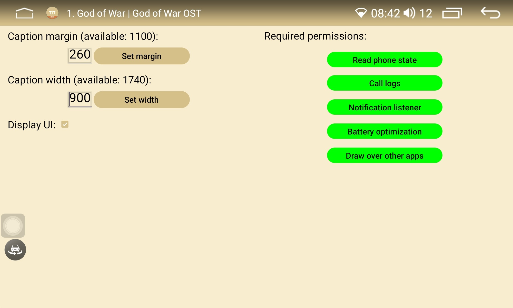
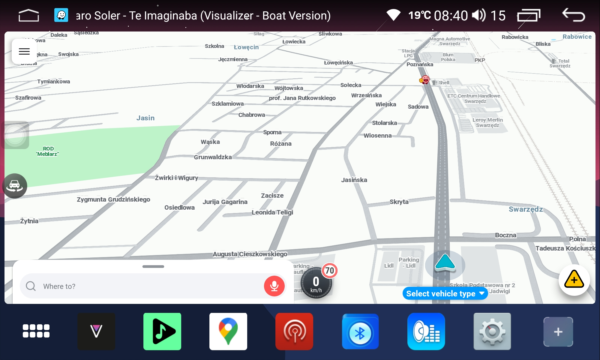
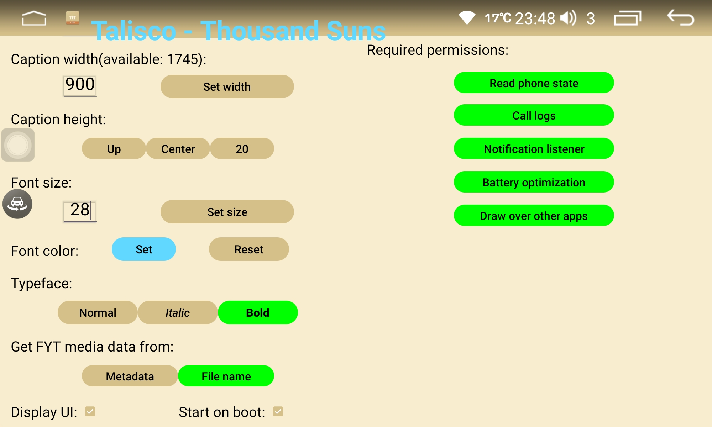
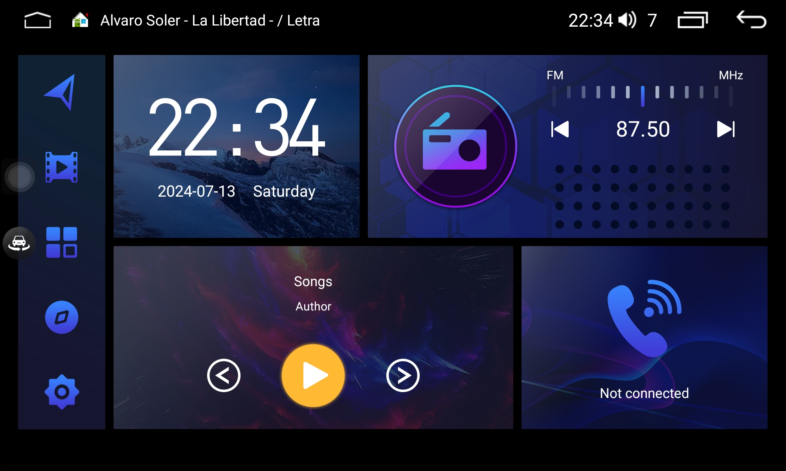

# Display Media Titles 

Android app for FYT displaying media titles on status bar. It displays also artist name if it's present in the metadata. Should work on Android 8 and above. Tested on Android 10 and 14.
App works only with the players that use MediaController which means that it should get along with most of the available music apps. Unfortunately FYT original players are not supported.

## Installation

App requires five permissions:
* Notification access to be able to read media metadata.
* Display over other apps to properly display titles.
* Battery optimization to keep service alive.
* Phone state to properly remove view on phone calls.
* Call logs to open app with dialer's "secret code"

Check this [tutorial](https://www.youtube.com/watch?v=H3tnNVyCJfk) in case you have a problem with Restricted Setting pop-up.

* Non-system app (works on phones and FYT):

	Download and install `display_media_titles_phone.apk` file. This version due to android restrictions will display titles only if a launcher has a fully transparent status bar.
	User will be prompted to grant permissions above on the first start. 
	
* System app (only for FYT):

	Download `installer.zip`, unpack it in a FAT32 formatted USB pendrive, then connect pendrive to you unit's USB port and wait, installation should start after few seconds.
	Works with every launcher.
	Permissions for system apps should be granted automatically.
	Use `uninstaller.zip` to remove the app.

* Setting view parameters:

	Very simple but intuitive layout allows to set left margin and width of the view depending on the device display width. Try it with long titles for proper setting.
	Please keep in mind that this app aims to work in the background therefore it minimizes after having all permissions granted and checked "Display UI" CheckBox. 
	
	To get the application's view please open the dialer and type `*#*#3368#*#*` (if it doesn't work with your stock dialer then please install [Phone by Google](https://play.google.com/store/apps/details?id=com.google.android.dialer&hl=en_US)), the app should open it's MainActivity. It is also possible to have the same effect by revoking one of the permissions or in case of non-system app, not to grant it on the first start  (i.e. display over other apps - remember to grant it back to see the result). Revoking notification access might result in the app's crash. User will be able to grant previously revoked permission by pressing according button which glares red if permission is denied.

 

## Generating app in Android Studio

Clone repository and use `keystore.jks` located in `DisplayMediaTitles\app`. Choose exisiting android key alias with password `android`. 
For non-system app remove `android:sharedUserId="android.uid.system"` from `AndroidManifest.xml`.

## Gallery

 
 

